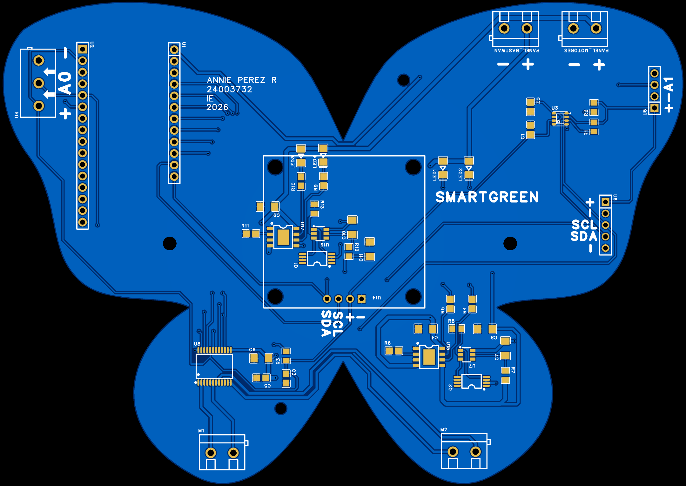
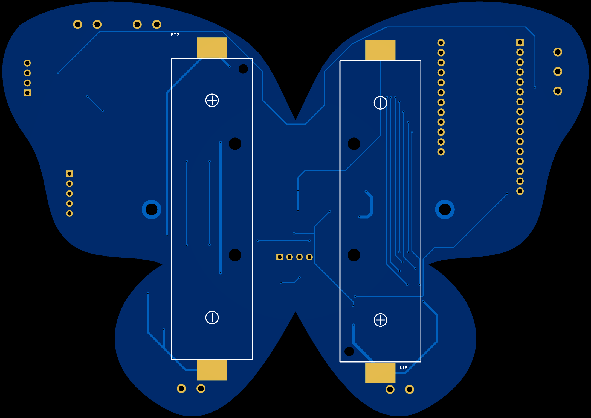
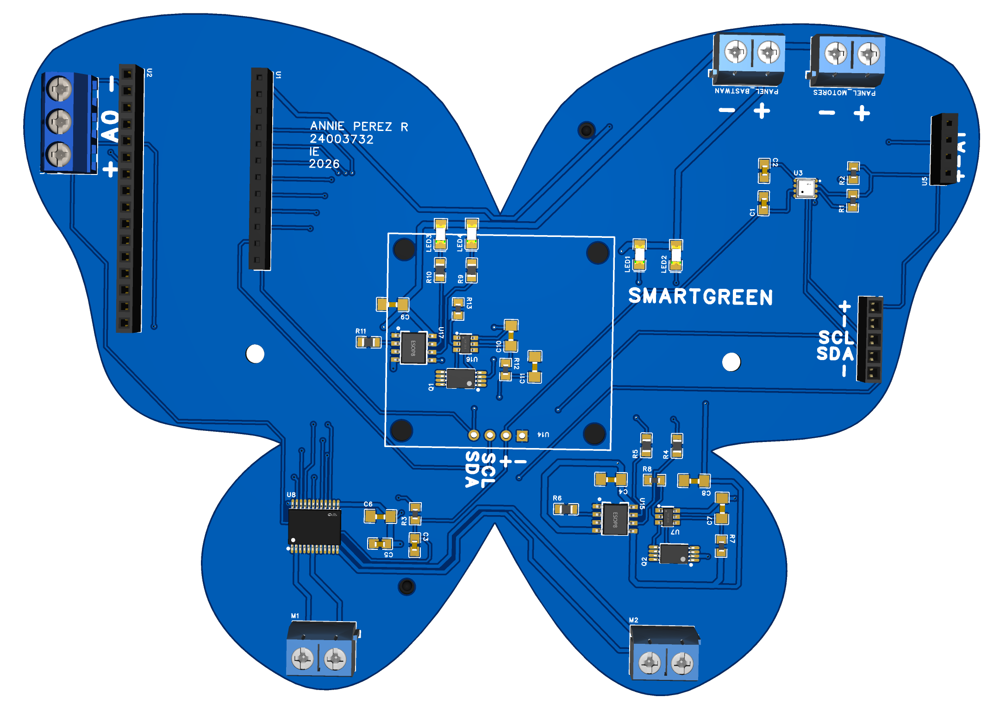
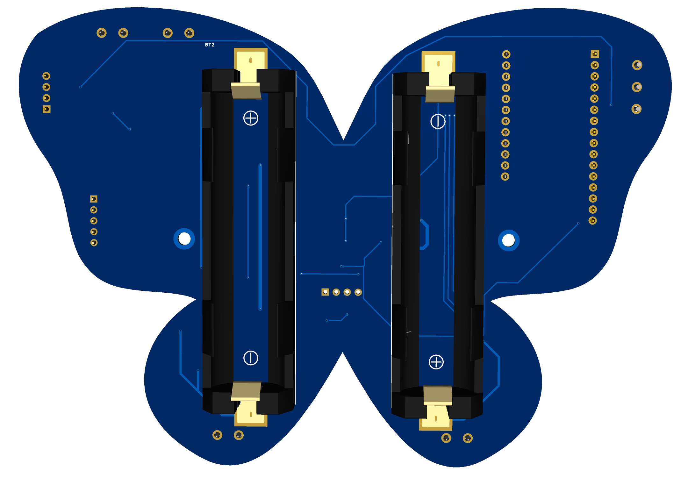

# 🌱 SmartGreen 
## Sistema de monitoreo ambiental y de sustrato con tecnología LoRa

**SmartGreen** es un sistema IoT diseñado para el monitoreo de variables ambientales y del sustrato en aplicaciones agrícolas, invernaderos o espacios donde se necesite supervisar el entorno de crecimiento de las plantas.

Es una solución de monitoreo inteligente diseñada para la digitalización de datos. El proyecto consiste en el despliegue de una red de nodos sensores
autónomos que utilizan la tecnología de largo alcance LoRa para supervisar, en tiempo real, las variables críticas que afectan el rendimiento del cultivo.Con la integración sensores de temperatura, humedad, presión atmosférica, calidad del aire, intensidad lumínica, humedad del suelo y temperatura de precisión. Además, incluye un sistema de control para microbombas de agua mediante un driver de motores, permitiendo funciones de riego automatizado o controlado.

---

# 🧩 Sistemas incluidos

| Sistema | Descripción |
|---|---|
| Comunicación LoRa | Permite enviar datos de forma inalámbrica a largas distancias. |
| Monitoreo ambiental | Mide temperatura, humedad, presión y calidad del aire. |
| Monitoreo de sustrato | Mide humedad del suelo y temperatura en suelo o agua. |
| Visualización local | Muestra datos en una pantalla OLED I2C. |
| Control de riego | Activa microbombas de agua mediante el driver TB6612FNG. |
| Alimentación solar | Usa panel solar, baterías 18650 y cargadores TP4056. |
| Protección de baterías | Incluye circuito de protección con DW01S y FS8205A. |

---

# ✨ Características principales

- Monitoreo ambiental con sensor **BME680**.
- Medición de intensidad luminosa con **BH1750**.
- Medición de humedad de suelo con **FC-28**.
- Medición de temperatura externa con **DS18B20 waterproof**.
- Visualización de datos en pantalla **OLED I2C**.
- Comunicación inalámbrica mediante **LoRa**.
- Control de una o dos microbombas usando **TB6612FNG**.
- Sistema de carga con **TP4056**.
- Protección de batería con **DW01S + FS8205A**.
- Alimentación mediante baterías **18650** y panel solar.
- PCB personalizada con forma de mariposa.

---

# 🧰 Componentes principales

| Componente | Función |
|---|---|
| BastWAN | Microcontrolador principal con comunicación LoRa |
| BME680 | Sensor ambiental de temperatura, humedad, presión y gases |
| BH1750 | Sensor de intensidad lumínica |
| DS18B20 Waterproof | Sensor de temperatura para suelo o agua |
| FC-28 | Sensor de humedad de suelo |
| OLED HS13L03B2C01 | Pantalla I2C para visualización local |
| TB6612FNG | Driver para microbombas de agua |
| TP4056 | Cargador de baterías Li-Ion |
| DW01S | Controlador de protección de batería |
| FS8205A | MOSFET doble para protección de batería |
| Baterías 18650 | Fuente de energía del sistema |
| Panel solar | Fuente de carga para el sistema |

---

# 🔌 Asignación de pines

## 📡 Bus I2C

Los dispositivos I2C comparten las mismas líneas de comunicación:

| Señal | Dispositivos conectados |
|---|---|
| SDA | BME680, BH1750, OLED |
| SCL | BME680, BH1750, OLED |
| 3V3 | Alimentación lógica |
| GND | Tierra común |

---

## 🌡️ Sensor DS18B20

| Señal | Pin BastWAN |
|---|---|
| DATA | A0 |
| VCC | 3V3 |
| GND | GND |

El pin de datos utiliza una resistencia pull-up de **4.7 kΩ** hacia **3V3**.

---

## 🌱 Sensor FC-28

| Señal | Pin BastWAN |
|---|---|
| AO | A1 |
| VCC | 3V3 |
| GND | GND |

---

## 🖥️ Pantalla OLED

| Señal OLED | Conexión |
|---|---|
| VCC | 3V3 |
| GND | GND |
| SCL | SCL |
| SDA | SDA |

---

## 💧 Driver TB6612FNG

| Señal TB6612FNG | Pin BastWAN |
|---|---|
| PWMA | D5 |
| AIN1 | D6 |
| AIN2 | D9 |
| STBY | D13 |
| PWMB | D10 |
| BIN1 | D11 |
| BIN2 | D12 |

---

## ⚡ Alimentación del TB6612FNG

| Pin TB6612FNG | Conexión |
|---|---|
| VCC | 3V3 |
| VM1, VM2, VM3 | VMOT |
| GND, PGND1, PGND2 | GND |

---

# 🔋 Sistema de alimentación

El proyecto incluye dos bloques de carga con **TP4056**:

| Bloque | Función |
|---|---|
| Carga VBAT BastWAN | Alimentación del BastWAN y sistema lógico |
| Carga VBAT Motores | Alimentación del sistema de motores/bombas |

Cada bloque utiliza:

- TP4056 para carga de batería.
- DW01S para protección.
- FS8205A como etapa de protección.
- LEDs indicadores de estado.
- Batería 18650.
- Entrada desde panel solar.

---

# 💡 Indicadores LED de carga

| LED | Estado |
|---|---|
| LED de CHRG | Indica que la batería se está cargando |
| LED de STDBY | Indica que la batería ya está cargada |

---

# 🦋 Diseño de PCB

<table>
  <tr>
    <th>TOP view 2D</th>
    <th>BOTTOM view 2D</th>
  </tr>
  <tr>
    <td align="center">
      
    </td>
    <td align="center">
      
    </td>
  </tr>
</table>

<table>
  <tr>
    <th>TOP viewr 3D</th>
    <th>BOTTOM view 3D</th>
  </tr>
  <tr>
    <td align="center">
      
    </td>
    <td align="center">
      
    </td>
  </tr>
</table>

---
# 🧾 Licencias

Este proyecto utiliza licencias de código abierto independientes para software y hardware:

* **Hardware:** [CERN-OHL-P-2.0](https://cern-ohl.web.cern.ch/) 
* **Software / Firmware:** [MIT License](LICENSE-MIT)

---
# 🛡️ Certificación OSHW
